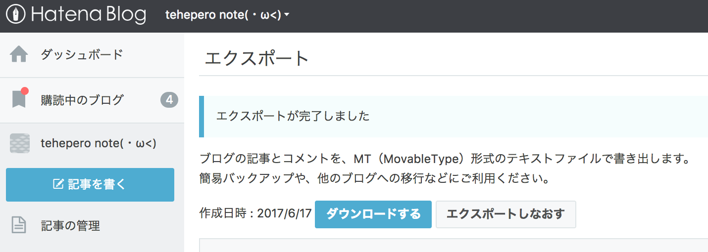

hateblo2hugo
=======

[](https://circleci.com/gh/stormcat24/hateblo2hugo)
[](https://golang.org/)
[](https://github.com/stormcat24/hateblo2hugo/issues?state=open)
[](LICENSE)
[](https://godoc.org/github.com/stormcat24/hateblo2hugo)

hateblo2hugo is a tool to migrate blog data of [hatenablog](http://hatenablog.com/) to markdown data for Hugo.


### Install

```bash
$ go get github.com/stormcat24/hateblo2hugo
```

### Preparation

Before use this tool, you must export blog data from hatenablog. Data format of hatenablog is Movable Type.



### Usage

```bash
$ hateblo2hugo migrate -i ~/your_path/your_hatenablog.export.txt -o ~/your_path/your_hugo_blog/blog/
```

### Migration Features

* Remove Hatena Keyword link
* Download images from hatena photo life, and locate files to `{blog_dir}/static/images` directory.
* Embed contents
    * Tweet
    * Speakerdeck
    * General links
    * GitHub Repository (use [lepture/github-cards](https://github.com/lepture/github-cards) )
* Code syntax

### Example using hateblog2hugo

* [http://stormcat.hatenablog.com](http://stormcat.hatenablog.com) to [https://blog.stormcat.io](https://blog.stormcat.io)

License
===
See [LICENSE](LICENSE).

Copyright © stromcat24. All Rights Reserved.
